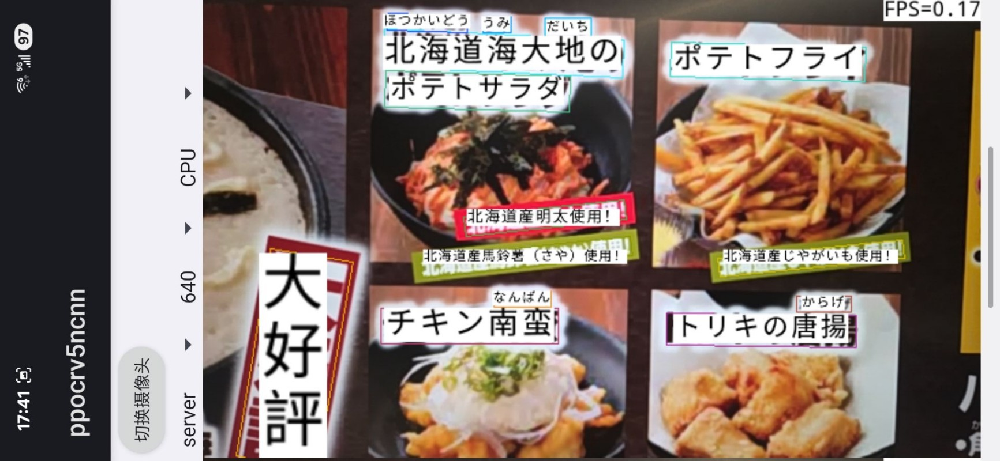
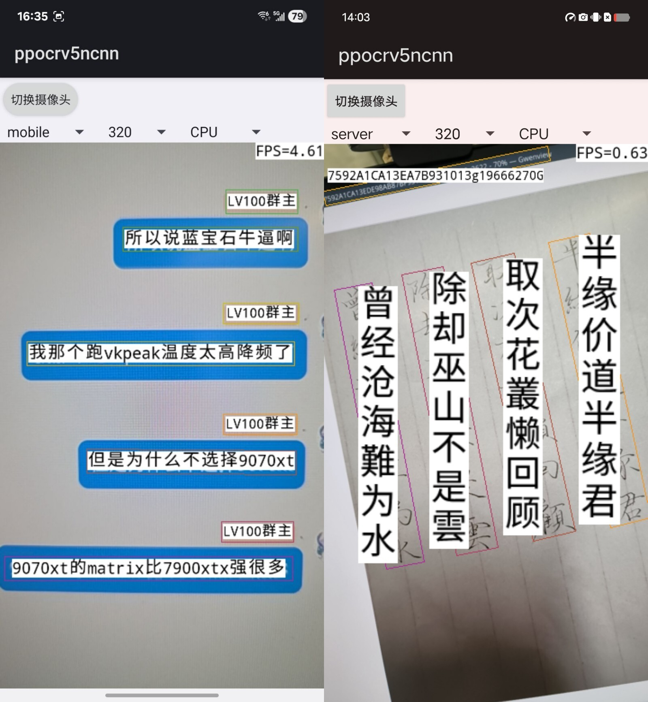

# ncnn-android-ppocrv5


PPOCRv5

This is a sample ncnn android project, it depends on ncnn library and opencv

https://github.com/Tencent/ncnn

https://github.com/nihui/opencv-mobile

## android apk file download
https://github.com/nihui/ncnn-android-ppocrv5/releases/latest

## how to build and run
### step1
https://github.com/Tencent/ncnn/releases

* Download ncnn-YYYYMMDD-android-vulkan.zip or build ncnn for android yourself
* Extract ncnn-YYYYMMDD-android-vulkan.zip into **app/src/main/jni** and change the **ncnn_DIR** path to yours in **app/src/main/jni/CMakeLists.txt**

### step2
https://github.com/nihui/opencv-mobile

* Download opencv-mobile-XYZ-android.zip
* Extract opencv-mobile-XYZ-android.zip into **app/src/main/jni** and change the **OpenCV_DIR** path to yours in **app/src/main/jni/CMakeLists.txt**

### step3
* Open this project with Android Studio, build it and enjoy!

## some notes
* Android ndk camera is used for best efficiency
* Crash may happen on very old devices for lacking HAL3 camera interface
* All models are manually modified to accept dynamic input shape
* Most small models run slower on GPU than on CPU, this is common
* FPS may be lower in dark environment because of longer camera exposure time

## screenshot



## guidelines for converting PPOCRv5 models

1. install paddleocr
```shell
pip install paddlepaddle==3.0.0
pip install paddleocr==3.0.0
paddlex --install paddle2onnx
```

2. test paddleocr and export onnx models
```shell
paddleocr ocr -i test.png
paddlex --paddle2onnx --paddle_model_dir ~/.paddlex/official_models/PP-OCRv5_mobile_det --onnx_model_dir PP-OCRv5_mobile_det
paddlex --paddle2onnx --paddle_model_dir ~/.paddlex/official_models/PP-OCRv5_mobile_rec --onnx_model_dir PP-OCRv5_mobile_rec
```

3. convert onnx models to ncnn with pnnx tool
```shell
pip install -U pnnx
pnnx PP-OCRv5_mobile_det.onnx inputshape=[1,3,320,320] inputshape2=[1,3,256,256]
pnnx PP-OCRv5_mobile_rec.onnx inputshape=[1,3,48,160] inputshape2=[1,3,48,256]
pnnx PP-OCRv5_server_det.onnx inputshape=[1,3,320,320] inputshape2=[1,3,256,256] fp16=0
pnnx PP-OCRv5_server_rec.onnx inputshape=[1,3,48,160] inputshape2=[1,3,48,256] fp16=0
```
